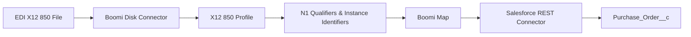

# Boomi EDI X12 850 to Salesforce Integration

A Boomi integration project that reads an X12 850 Purchase Order from disk, processes EDI qualifiers and instance identifiers, maps the purchase order into a Salesforce custom object, and creates the record through the Salesforce REST API.

## Architecture



## Integration Flow

1. Boomi reads an X12 850 Purchase Order from disk.
2. The X12 850 EDI profile parses the document.
3. N101 qualifiers identify:
   - `BT` — Bill To
   - `ST` — Ship To
   - `SF` — Ship From
4. Instance Identifiers distinguish the repeating N1 loops.
5. The Boomi Map transforms the EDI fields into the Salesforce structure.
6. The Salesforce REST connector creates a `Purchase_Order__c` record.

## Field Mapping

| X12 850 Source | Salesforce Field |
|---|---|
| BEG03 | Name |
| BEG05 | Order_Date__c |
| N1 Loop [BT] → N102 | Bill_To_Name__c |
| N1 Loop [BT] → N4 → N401 | Bill_To_City__c |
| N1 Loop [ST] → N102 | Ship_To_Name__c |
| N1 Loop [ST] → N4 → N401 | Ship_To_City__c |
| N1 Loop [SF] → N102 | Ship_From_Name__c |

## Repository Structure

```text
.
├── boomi/
│   └── exports/
├── docs/
│   ├── architecture/
│   ├── screenshots/
│   └── troubleshooting.md
├── sample-data/
│   ├── inbound/
│   └── expected-output/
├── salesforce/
│   ├── object-schema.md
│   └── permissions.md
├── README.md
└── .gitignore
```

## Boomi Components

The Boomi components used by this integration are documented in:

[Component Inventory](boomi/component-inventory.md)

The EDI-to-Salesforce mapping has also been exported from Boomi:

[Map Export](boomi/exports/x12-850-to-salesforce-map.xlsx)